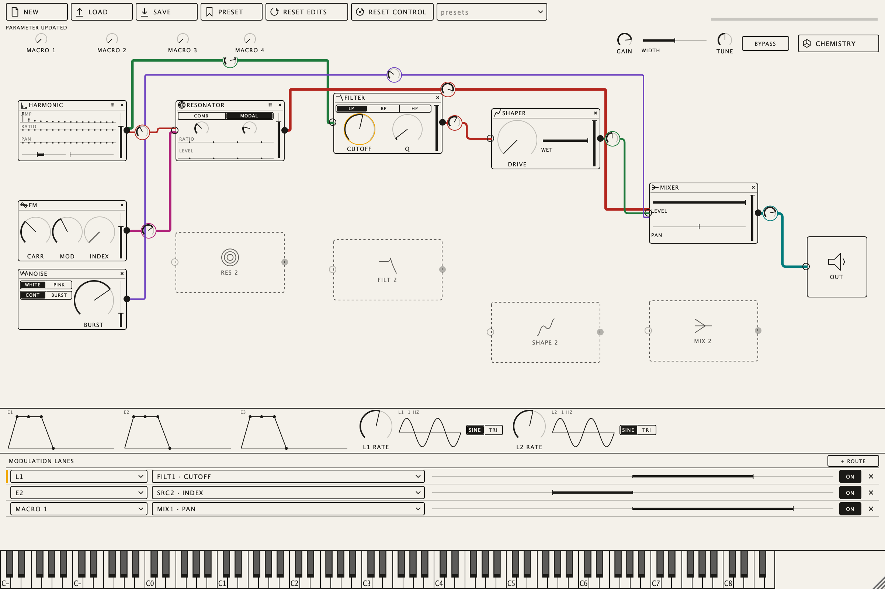

# IUPAC Synth 2

A polyphonic modular synthesizer that can also turn molecules into sounds.

The synthesizer stands on its own: fourteen module types (harmonic, FM, noise, classic oscillator, wavetable, sub, resonator, filter, shaper, mixer, chorus, delay, reverb, width) sit in sixteen fixed slots on one screen. You patch audio between them by dragging cables, and a lane-style modulation matrix routes four envelopes, two LFOs, velocity, keytrack and four macros to any parameter. There are sixteen voices with up to seven unison copies per source.

The chemistry extension takes an IUPAC name, a SMILES string or an entry from the bundled offline browser of about 30,000 common compounds. It analyses the structure with RDKit and OPSIN and generates an ordinary, fully editable patch from it. Generated sounds are normal preset files. Nothing is hashed into noise, and nothing needs a network connection.



## Download

Releases are on the [Releases page](https://github.com/highda/iupac-synth-v2/releases). Each one ships:

- **Linux arm64** (Debian 12): Standalone, VST3, `iupac-cli` and a product doctor.
- **macOS arm64** (macOS 12 or later): VST3, AUv2, Standalone and `iupac-cli`. These are ad-hoc signed and not notarized, so clear the quarantine flag after extracting (see the release notes).

Both packages are self-contained: the Python/RDKit helper, a private Java runtime, OPSIN and the discovery index travel inside every format, so you don't install Python or Java yourself. Check downloads with `sha256sum -c SHA256SUMS`.

## Documentation

- [User guide](docs/USER-GUIDE.md): installing, the editor, the chemistry popup, the CLI
- [Building from source](docs/BUILDING.md): CMake presets, tests, packaging and release workflows
- Architecture: [overview](docs/architecture/ARCHITECTURE.md), [design decisions](docs/architecture/DECISIONS.md), [chemistry](docs/architecture/CHEMISTRY.md), [mapping policy](docs/architecture/MAPPING-POLICY.md), [discovery](docs/architecture/DISCOVERY.md), [toolchain](docs/architecture/TOOLCHAIN.md), [verification gates](docs/architecture/VERIFICATION.md), [realtime audit](docs/architecture/REALTIME-AUDIT.md)

## Quick build (chemistry off)

```sh
cmake --preset linux-synth          # or mac-synth on macOS arm64
cmake --build --preset linux-synth --parallel 4
ctest --preset linux-synth
```

## License

IUPAC Synth 2 is free software under the [GNU Affero General Public License v3.0](LICENSE). It is built on [JUCE](https://juce.com), which is used under its AGPL-3.0 option.

The bundled third-party components keep their own licenses: RDKit (BSD-3-Clause), OPSIN (MIT), OpenJDK 17 (GPL-2.0 with Classpath Exception), Python (PSF), NumPy (BSD-3-Clause), SQLite (public domain), the PyInstaller bootloader (GPL-2.0 with exception), and the AKWF wavetables (CC0-1.0, [`third_party/akwf`](third_party/akwf)). Discovery data comes from Wikidata (CC0). See [package notices](docs/package-notices.md); every release carries the full notices in its `notices/` directory.
