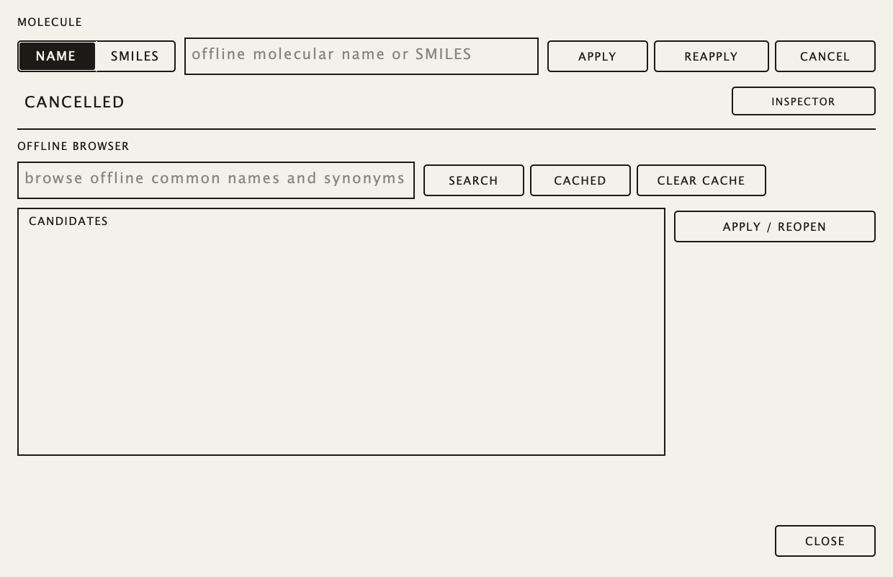

# IUPAC Synth 2 user guide

## Download

Builds are published on the repository's
[Releases page](https://github.com/highda/iupac-synth-v2/releases). Each release attaches the exact CI-tested files plus
`SHA256SUMS`; verify after downloading (`sha256sum -c SHA256SUMS`, or
`shasum -a 256 -c SHA256SUMS` on macOS). `IUPAC-Synth-2-linux-arm64.tar.gz`
is the complete chemistry-enabled product for Debian 12 arm64 described below.
`IUPAC-Synth-2-macos-arm64.tar.gz` holds the ad-hoc-signed arm64 VST3,
AUv2 component, Standalone app and CLI; the release notes state whether that
build has chemistry enabled. In a chemistry-enabled macOS archive every format
carries its own complete private payload — the frozen Python/RDKit helper, the
private OpenJDK 17 runtime, OPSIN and the offline discovery snapshot — inside
`Contents/Resources/chemistry`, and the CLI uses the `resources/chemistry`
directory beside it. Nothing has to be installed: no Python, Java or RDKit, and
no network access at any point. Keep `iupac-cli` and `resources/` together; each
bundle works on its own.

Unsigned macOS downloads must have quarantine cleared before the first launch or
plugin scan:
`xattr -dr com.apple.quarantine "IUPAC Synth 2.vst3" "IUPAC Synth 2.component" "IUPAC Synth 2.app" iupac-cli`.
Copy the VST3 to `~/Library/Audio/Plug-Ins/VST3/` and the component to
`~/Library/Audio/Plug-Ins/Components/`. Run `./iupac-product-doctor .` in the
unpacked directory after moving or copying it to check the private payload.

The first analysis after a fresh install or copy is slow — on macOS the system
validates every file of the payload the first time it is loaded, which measured
15.8 s for the helper and 7.9 s for the first name lookup against 0.2 s and
5.3 s afterwards. That is why the request deadline is 45 s; later requests are
quick. Some hosts run AudioUnits out of process in a sandboxed
`AUHostingServiceXPC`, so if chemistry works in the Standalone app or the VST3
but not the AU, report it as an AU-hosting defect rather than a payload
problem.

## Running

Run `bin/IUPAC Synth 2` or install `lib/vst3/IUPAC Synth 2.vst3` in the
host's VST3 directory. The editor is one screen (default 1200×800, resizable
1000×700–1800×1200) with no tabs:

- **Top strip.** New / Load / Save / Preset (save into the preset library) /
  Reset edits / Reset controls, the preset picker, the output meter with voice
  count and audible generation, the four macros (double-click a macro caption
  to type `LABEL | default`), and the global controls gain, width, tune and
  bypass. The extension build adds the **Chemistry** launcher.
- **Module field.** Eleven fixed typed slots — three sources (harmonic, FM,
  noise, classic oscillator or wavetable), two resonators, two filters, two shapers, two mixers — plus the OUT
  bus. An inactive slot is dashed: click it to activate it in place (source
  slots ask which of the five source types). The × in a slot header
  deactivates it and removes its cables and lanes. Each active slot shows only
  its own controls: knobs for tone/shape values, faders for level/mix values
  (the vertical fader on every slot's right edge is its output level, beside
  the OUT port), segment toggles for modes, and a "forest" of vertical lines
  for every array — press and drag across the lines to draw partial
  amplitudes, ratios (deviation around each harmonic, on a log axis), pans and
  resonator mode ratios/levels. Tilt and inharmonicity faders under the
  harmonic forests regenerate the arrays. The ▤ glyph in a slot header opens a
  numeric table for its arrays.
- **Ports and cables.** Every slot has one IN port (left) and one OUT port
  (right); the OUT bus has only IN. Drag from an OUT port and drop on an IN
  port to connect; targets that would form a cycle, enter a source or exceed
  the 32-edge cap are drawn inert during the drag and drops on them do
  nothing. Each cable has its own colour, a stroke weight that follows its
  gain and a gain knob on its longest horizontal run. Remove a cable with
  right-click → Remove, or drag its IN end off the port and drop it anywhere
  that is not a port. Hovering a cable highlights it and both of its ports.
- **Values.** Hover or drag any control for its value; double-click a knob,
  fader, forest line or envelope handle to type a value (Enter commits,
  Escape cancels); the scroll wheel nudges the hovered control. When a lane
  modulates a knob or fader, the value the engine is actually using is drawn
  as an accent ring or line over the base value.
- **Modulator strip.** E1–E3 as draggable ADSR curves (attack, decay and
  release on x, sustain on y) and L1–L2 with a rate knob, waveform preview and
  SINE | TRI toggle.
- **Lane matrix.** `+ ROUTE` adds a modulation lane; each lane is source
  (E1–E3, L1–L2, VEL, KEY, BEND, CC1, MACRO 1–4) · destination (active slot ·
  parameter) · bipolar depth bar (double-click to type) · ON · ×. Selecting a
  lane highlights its destination control. Lanes are the only element you add
  or remove; the stack scrolls past the 24-row cap.
- **Keyboard.** The audition keyboard at the bottom plays the instrument; text
  entry never triggers it.

CPU load scales with unison voices × active sources × held notes: stacking the
maximum unison on every source slot at full polyphony is expected to exceed
real time on current hardware, so raise unison on the source that carries the
sound rather than on all of them.
The heaviest patch the instrument is tested with (every slot active, 48 cables,
40 matrix rows, unison 7 on one source, the full effects tail, 16 held notes)
takes about 1.2x real time on the reference arm64 machine, so it will crackle
when every voice is held. The heaviest generated patches take about 60% of one
core with 16 held voices; ordinary patches stay well under half.

The four macros plus width, master tune, output gain and bypass are stable
host controls. Sounds are ordinary `.iupacpatch` State v1 files containing the
exact base and edited Patch, controls and optional inert provenance. Saving or
restoring never runs chemistry. User presets live outside the disposable
generated-result cache; clearing that cache cannot delete presets.

## Oscillator and wavetable sources

Two of the five source types are the classic building blocks:

- **Osc** — sine, triangle, saw or square, band-limited. **Width** is the
  square's pulse width; route an LFO to it in the lane matrix for PWM.
- **Wavetable** — click the table name to pick one of 32 tables (the mouse
  wheel steps through them); **Pos** morphs through the table's sixteen
  frames and is the control to modulate. The first eight tables are
  synthesized (analog shapes, harmonic sweep, PWM, vowel formants, organ
  registrations, sync sweep, FM, digital comb). The other twenty-four are
  sampled instrument cycles — cello, violin, flute, clarinet, oboe, alto sax,
  piano, electric piano, organ, guitars, basses, voice, FM synth, chip and
  video-game waves, granular, overtone and more — ordered dark to bright
  across Pos.

Both have the same unison row (copies, detune, spread, phase, drift) and pitch
row (octave, semitones, fine, key tracking) as the harmonic and FM sources.

The sampled tables come from Adventure Kid Waveforms (AKWF-FREE) by Kristoffer
Ekstrand, dedicated to the public domain under CC0 1.0. Thank you.

## Chemistry

In the extension build the **Chemistry** button opens a modal popup:

Choose NAME or SMILES, type the input and press Apply; the popup closes and
the top-strip status reports progress until the generated patch is audible as
active slots, cables and lanes. Search browses the bundled offline snapshot
and requires explicit selection when names are ambiguous; Cached lists
generated results; Apply / reopen loads the selected candidate or cached
sound. Inspector reveals the analysis / SonicIntent / mapping trace. Apply
uses the private bundled helper and runtimes; it needs no network, Python or
Java installation. A failed or cancelled request preserves the current sound.
Reset edits returns to the generated base, Reapply uses the current mapper
(a patch saved before this version keeps its old sound until you Reapply),
and Reset controls affects only live controls. `bin/iupac-cli` provides the
same analyze, generate, discovery, inspect and render paths; run it without
arguments for product identity. Run `bin/iupac-product-doctor` after
relocation or suspected damage. A doctor failure means repair or reinstall the
complete directory.

### How a molecule becomes a sound

The structure picks the instrument, not a random seed. Roughly:

- **The skeleton picks the waveform.** Benzene-type rings give a square,
  rings with nitrogen or oxygen in them a pulse, double bonds and long chains
  a saw, saturated rings a triangle, the smallest molecules a sine.
- **Functional groups pick an instrument table.** Amides (peptides) sing,
  fused ring systems (steroids, alkaloids) are organs, alcohols and ethers are
  winds, acids and esters are keys, amines are plucked strings, long greasy
  chains are bowed strings, nitro and nitrile groups are harsh.
- **Metals are the only bells.** Sulfur and phosphorus oxides ring like tines.
- **Build picks the envelope.** Small rigid molecules are plucked or struck,
  ring systems hold like an organ or a lead, large floppy ones swell into pads.
- **Polarity is brightness; size is space and weight.** Charge, strain and
  halogens add drive and air.
- **Where things sit matters.** Isomers with the same atoms in a different
  order get a different timbre position, filter setting and decay.
- **Handedness is stereo.** Mirror-image molecules lean opposite ways.

The four macros are always Tone, Motion, Edge and Space. The Inspector shows
every decision with the traits that drove it.
