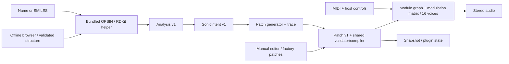

# Architecture — modular instrument, then molecular patch generation

Architecture version 3, 2026-09-15. Patch v1 and State v1 remain compatible throughout. [DECISIONS](DECISIONS.md) records the design decisions and which of them are fixed, implementation latitude or provisional. Numeric DSP/resource defaults below are the selected release policy, not perpetual product requirements; D1–D7 defines which may change with evidence; D6 records the 2026-09-18 editor rebuild and patch-bound change (phase 3, #65). **Architecture v3.2** (2026-09-20): D8 records the phase 4 sound-engine breadth — new module kinds, new parameters, the post-mixer effects region, audio-rate modulation ports and the raised patch bounds (phase 4, #104). The architecture version string stays `3`; Patch and State stay version 1.

## Product boundary

First build a complete polyphonic modular instrument: users create patches by adding/removing modules, connecting audio paths, editing all module parameters, and assigning modulation in a matrix. It must play MIDI, expose host controls, save/restore patches, and render offline with chemistry disabled at build time. Then add a chemistry-to-patch generator as another author of the same public Patch contract. Generated patches remain fully editable with the same controls. Chemistry must never become a hidden engine dependency or a replacement for manual sound design.

The released instrument accepts explicit Name/SMILES input offline and includes all required chemistry runtimes. End users install neither Python nor Java. Linux arm64 VST3, Standalone and CLI are the canonical targets. macOS arm64 VST3/AUv2/Standalone/CLI are native targets carrying the same self-contained chemistry payload, validated with pluginval and `auval`.

Finite scope: the catalog and bounds below, native editor, MIDI, presets, four assignable macros, chemistry extension with offline common-name discovery/cache, production inspector/renderer, documented automatic and human gates. Excluded: Windows, AUv3/CLAP/AAX/VST2, MPE, microtuning, sequencer/arpeggiator, sample import/library, external module SDK, runtime code loading, unrestricted graphs, inter-node feedback, molecule drawing/reactions, cloud/ML, runtime online discovery in this release, randomizer or text-hash sound generation, v1 preset import, commercial installer/signing/notarization. Bounded audio connections and matrix editing ARE required, not excluded as “arbitrary patch cables.” No universal molecule-to-unique-sound guarantee. Phase 4 (D8) moves three former exclusions into scope in bounded form only: the **four fixed effects slots** below (one chorus, one stereo delay, one reverb, one width — a fixed region, not an extensible rack), and **audio-rate modulation** restricted to the two declared typed modulation inputs (FM `modIn`, resonator `exciteIn`) on an acyclic graph — not a general modulator network. Wavetables, sample import, an extensible effects rack, inter-node feedback and cycles remain excluded. Phase 5 (D12) lifts the wavetable exclusion for **built-in tables only** — synthesized in-repo or vendored under a CC0-class licence; user wavetable import and sample import remain excluded.

## Alternatives and owned complexity

| Option | Assessment |
| --- | --- |
| Preserve v1's flat patch and six parallel lanes | Reject: imports chemistry vocabulary into DSP and preserves known convergence mechanisms. Minimal engine source reuse from v1. |
| A small set of synthesis recipes | Reject: reduces implementation effort by removing the requested independently usable module/matrix instrument. Factory patches may illustrate graphs; they cannot define the legal topology set. |
| Unrestricted modular framework / AudioProcessorGraph per voice | Reject: dynamic processors, general connection lifetime, cycles and extension APIs exceed this product's needs. |
| Bounded Patch graph compiled into fixed voice storage, using JUCE primitives | Select: genuinely editable composition with explicit CPU/memory bounds. Own a small validator/compiler/scheduler, not a general graph framework. |
| iPlug2, or CLAP plus separate UI/DSP/state libraries | Credible alternatives, but iPlug2's [documented CMake support](https://iplug2.github.io/docs/md_cmake.html) excludes Linux; separated SDKs add integration for selected formats/UI/state. JUCE is retained: no demonstrated reduction in total owned work warrants replacing the already build-tested foundation. See DECISIONS for the revalidated build-versus-buy register. |

Use JUCE directly for plugin wrappers, native components, APVTS, JSON/WAV, MIDI, ADSR, oscillation/filter/delay/oversampling/limiting and tests. Custom musical composition, patch compilation, fixed voice scheduling and molecular mapping carry the product-specific work. No automatic wrapper around every library API.

## Dependency direction and production components

- **Synth domain:** chemistry-free values and production codecs for Patch, module/parameter descriptors and synth state. JUCE core is allowed; deterministic domain functions perform no I/O. Catalog descriptors are the single source for validation, editor fields, parameter normalization and compiler dispatch.
- **Synth engine:** JUCE audio_basics/dsp plus bounded graph execution, musical module composition and fixed MIDI/voice scheduler. Receives compiled fixed-size patches and control frames. No chemistry/mapper/UI/process/files/host-processor dependency or parameter-name lookup during audio.
- **Synth shell/editor:** JUCE AudioProcessor/APVTS, native manual editor and one non-audio coordinator for patch transactions/state. Complete and useful before chemistry. Chemistry-disabled build must omit helper resources and chemistry targets entirely.
- **Chemistry helper:** one Python production analyzer using RDKit and OPSIN; frozen with private runtimes for delivery. Child process outside DAW audio process. Produces Analysis, never module/parameter IDs. No alternate heuristic backend.
- **Projection/generator extension:** Analysis → synth-independent SonicIntent → Patch plus trace. Projection knows no synth module IDs; generator depends on public synth contracts. The synth never links back to either. Optional provenance sits in the document shell, not the engine Patch.
- **Discovery:** optional-to-use local snapshot/search/cache in the helper and extension shell, specified in [DISCOVERY](DISCOVERY.md). Validated structure becomes ordinary Analysis; saved presets use the synth State codec and require no discovery.
- **CLI:** thin JSON/WAV/process adapter sharing the exact domain codecs, compiler, renderer and, when enabled, chemistry extension. No independent “test interpretation” of chemistry or audio.

CMake option `IUPAC_ENABLE_CHEMISTRY=OFF` must build the complete synth library, plugin, Standalone, manual editor and CLI patch operations without RDKit/OPSIN/Python/Java dependencies. The [V0 gate](VERIFICATION.md#required-automated-gates) is a prerequisite for all chemistry implementation. Python may run development metrics in the development container; it is never needed by the installed synth-only product.

## Contract matrix

| Canonical representation | Production owner | Consumers / inspection | Persistence | Automatic proof | Human proof |
| --- | --- | --- | --- | --- | --- |
| Analysis v1: exact canonical molecular graph/descriptors, backend provenance | RDKit helper + shared C++ decoder | Projection, input inspector / `analyze` | Optional provenance, versioned fixture JSON | Identity equivalence/distinctions, independent counts, packaged parity | Name/form/error interpretation |
| SonicIntent v2 (D13): structural profile + perceptual traits; v1 was seven axes | Sole projection | Generator / sonic inspector | Optional provenance with projection version | Finite sparse deterministic values/traces | Understandable correspondence |
| Generated result: public Patch + ordered mapping trace | Sole generator using synth validator | Same editor/compiler / mapping inspector | Exact base Patch, versions/settings; optional cache | Equivalent identity → same base Patch; V3/V4 production coverage | Musical differentiation |
| Patch v1: stable nodes/types/complete parameters/arrays, modulators/macros | Synth domain codec/validator | Every author, compiler, editor, CLI / Patch inspector | Explicit JSON within State | Round trip, schema/bounds, silent and authored patches | All parameters editable |
| Audio graph: Patch nodes + weighted stereo edges | Synth validator/compiler | Engine/editor / graph and compiled inspector | In Patch, never a second graph schema | DAG/endpoints, serial/parallel/fan-out, pruning and PCM | Displayed routing matches sound |
| Modulation matrix: Patch rows/source/destination/depth/enable | Same domain/compiler + engine interpretation | Manual and generated authors / matrix/effective inspector | In Patch | Sum once, clamp once; cancellation/order/source/destination PCM regressions | Useful note-preserving edits |
| CompiledPatch: bounded order/slots/resolved indices/values | One off-thread compiler | Audio engine and compiled inspector | Not stored; rebuilt from exact Patch | Deterministic compile and effective controls, no alternate test compiler | None separately |
| HostControls: four macros + four globals with stable IDs | One host table/control adapter | APVTS/editor/engine / effective inspector | State controls, independent of base Patch | Adapter parity, bounds, automation/state round trip | DAW gestures/automation |
| State v1: basePatch, editedPatch, controls, optional provenance | Shared synth codec, shell transport | Plugin/CLI/preset library | `.iupacpatch` and equivalent host state, ≤1 MiB | Exact helper-free restore, bounded corrupt/future input | Saved project sounds/looks correct |
| DiscoveryRecord v1: names/IDs/source revision/validated structure/status | Discovery adapter + same chemistry validator | Browser/name resolution / discovery inspector | Snapshot/cache only; optional inert provenance copy | Ambiguity/conflict/identity validation | Candidate clarity |
| Discovery cache: versioned record/query keys, generated-State file references | Helper sqlite3 + coordinator State-file operations | Browser / cache inspector | Disposable separate SQLite and `.iupacpatch` files | Version invalidation, concurrency/corruption/eviction; no preset deletion | Clear/reopen behavior |
| User preset/library entry: ordinary exact State file + filename/optional label | Existing synth State codec/file loader | Preset list/editor/CLI | Portable `.iupacpatch`, never a required DB | Load after removing cache/dataset/helper; exact controls | Useful save/find/reopen flow |
| Realtime state: voices, phase, delays, envelopes, controllers, transitions | Audio thread only | Engine; bounded atomic telemetry | Never persisted or remapped | RT/sanitizers, MIDI/reset/retirement/transitions, CPU/memory | Clicks, playing response |
| Offline render: stereo frames + sample-offset MIDI/control timeline | Same production engine as plugin | CLI, gates / effective/render manifests | WAV + exact settings/version manifest | Bit determinism on pinned binary; block invariance, safety | Listening, pitch/dynamics |

Decode once through shared production validation. Enforce byte/depth/container limits before expensive parsing or copying (including optional provenance); do not read an unbounded file and check its size afterwards. Keep existing codec rather than introducing a parallel JSON schema implementation. Reject missing required fields, wrong types, nonfinite values, oversized arrays, duplicate IDs and unknown versions/enums. Ignore only documented optional metadata. Source class names and file layout are delegated.

## Patch, modules and audio graph

Patch schema 1 has at most **16 audio nodes, 48 audio edges, 40 modulation rows, 4 envelopes and 2 LFOs** (D8; raised from 11/32/24/3 on 2026-09-20 so every phase-4 slot can be live and routed and the fourth envelope exists; earlier bounds were 8/16/16 before D6). The wire format and Patch version are unchanged and every patch valid under an earlier bound remains valid; a patch with three envelopes decodes with E4 at its construction default. Node cap 16 = 3 general source + 1 sub + 2 resonator + 2 filter + 2 shaper + 2 mixer + 4 effects slots; the edge cap keeps the D6 ratio of roughly three edges per node; the row cap allows two modulated destinations per node plus headroom for the new unison/drift/filter-envelope routes. Preallocation consequence (as #67 recorded for D6): per-voice compiled storage, scratch buffers, the FIFO command payload and the effective-parameter atom array are all sized from these constants for sixteen voices in two banks, and the measured total working set must be recorded and stay within the ≤128 MiB bound; effects-region nodes are prepared once in the global tail, not per voice. Nodes have stable patch-local IDs, registered type, complete parameter values and any explicit coefficient arrays. Edges have source ID, destination ID (or final output bus), and gain [0,1]. All nodes have one stereo output; processors accept a sum of incoming stereo edges. Sources have no audio input. An edge source/destination pair is unique; summing fan-in is explicit, never silently normalized by connection count. Module output level and edge gain allow manual mixing.

The audio graph is a DAG, compiled off-thread with deterministic topological order (stable ID tie-break), slot/parameter resolution and scratch-buffer assignment. Reject self-edges, cycles, missing endpoints, edges into sources and graphs exceeding bounds. Fan-out and parallel/serial branches are allowed. Disconnected nodes may remain for editing but are pruned from execution. Empty/unconnected output is a valid silent authored patch. No fixed recipe ID, mandatory lane mix or chemical fields exist in Patch.

The built-in catalog is the release compatibility set. Its existing membership/IDs/arities and safety bounds remain fixed; DSP equations/defaults within those bounds are D3 policy with version/PCM evidence. D12 appends two more source types (`osc`, `wavetable`) for **fourteen**. D8 extends the catalog from seven to **twelve registered types** and adds parameters to existing types; nothing is removed or renamed and no existing range, default or arity changes:

| Type / fixed slot count (slots sum to the 16-node cap) | Controls and implementation |
| --- | --- |
| Harmonic oscillator / 3 general source slots shared by harmonic, FM and noise | 16 sine partials, explicit amplitudes [0,1], ratios [0.5,32], pan [−1,1]; editable tilt [−2,2] and inharmonicity [0,0.02] convenience controls regenerate explicit arrays off-thread. Direct sine evaluation or JUCE sine infrastructure; no redundant oscillator wrapper. Cull partials above 0.45 internal sample rate. D8 adds the unison block, the spectral-shape block (harmonicity morph, odd/even balance, symmetry) and the pitch block below. |
| FM oscillator / shares the 3 general source slots | Two sine operators; carrier ratio [0.5,4], modulator ratio [0.25,8], index [0,6]; no internal feedback. Index is unchanged through MIDI 84, then rolls off linearly to zero at MIDI 127. D8 adds the unison block, the pitch block and the `modIn` audio-rate modulation input. |
| Noise / shares the 3 general source slots | White/pink, continuous or note-on burst [1,500] ms. Xorshift32 uses shifts 13/17/5 and resets from patch seed XOR stable node-ID hash × `0x9e3779b9` XOR MIDI note shifted 16 XOR channel × `0x85ebca6b` (replace zero with one). Pink uses fixed two-pole coefficients in production source. No chemical hash or wall-clock entropy in engine. Unchanged by D8. |
| **Sub oscillator (`sub`) / 1 dedicated source slot** | New in D8. One sine or triangle oscillator one or two octaves below the voice fundamental, following MIDI, masterTune and bend like every pitched source. Direct evaluation; no wavetable. It occupies its own slot so the three general source slots keep their existing meaning and cap. |
| Resonator / 2 slots | Mode comb or four-mode bandpass; tune ratio [0.5,4], comb feedback [0,0.97], modal Q [0.5,12], explicit mode ratios [0.5,4] and levels [0,1]. JUCE DelayLine/TPT primitives; internal bounded feedback only. D8 adds the `exciteIn` audio-rate excitation input. |
| Filter / 2 slots | JUCE TPT low/band/high-pass, cutoff [30,18000] Hz additionally capped at 0.4 output sample rate, Q [0.5,8]. D8 appends `ladder24` and `notch` to the mode choices and adds in-filter drive, cutoff keytracking and bipolar envelope amount. |
| Shaper / 2 slots | Bounded tanh, directly or via JUCE WaveShaper, drive [1,16], wet [0,1]. D8 adds a `curve` choice; `tanh` is index 0 and is the unchanged existing behaviour. |
| Mixer / 2 slots | Stereo fan-in, level [0,1], pan [−1,1]; all nodes also expose output level [0,1]. Useful explicit branch control; no automatic six-lane mix. Unchanged by D8. |
| **Classic oscillator (`osc`) / shares the 3 general source slots** | New in D12. One band-limited shape per unison copy: `waveform` sine, triangle, saw or square (default saw); `pulseWidth` [0.05,0.95] shapes the square and is matrix-modulatable (PWM), with its DC term removed. polyBLEP on the saw and pulse steps, polyBLAMP on the triangle corners, at the 2× internal rate. Unison block and pitch block as on harmonic/FM; `outputLevel` default 0.7. Cost class C2. |
| **Wavetable source (`wavetable`) / shares the 3 general source slots** | New in D12. `table` selects one of thirty-two built-in tables (append-only list in `Wavetables.hpp`): eight synthesized from formulas and twenty-four sampled from AKWF-FREE (CC0). Each table is sixteen single-cycle frames; `position` [0,1] crossfades adjacent frames and is matrix-modulatable. Every frame is stored per octave band, truncated to the harmonics that band may carry below 0.45 of the internal rate, and read with linear interpolation. Tables are built on first use by the patch compiler, off the audio thread, about 0.8 MiB each and kept for the process; the audio thread only reads built tables and renders silence for one that is not. Unison block and pitch block as on harmonic/FM; `outputLevel` default 0.7. Cost class C2. |
| **Chorus (`chorus`), stereo delay (`delay`), reverb (`reverb`), stereo width (`width`) / 4 dedicated effects slots, one of each type** | New in D8, built from pinned JUCE DSP primitives (DECISIONS "retain pinned JUCE"): `juce::dsp::DelayLine` for chorus and delay, a fixed algorithmic network for reverb, mid/side arithmetic plus one TPT crossover for width. Each has a dry/wet `mix` (width has none — it is a whole-signal transform). All four are prepared off the audio thread and allocate nothing during render. This is a fixed four-slot region, not an extensible rack. |

**Effects region and the global tail.** The four effects slots are compiled into a **global post-mixer tail** that runs once per block on the summed voice output, not once per voice. Router constraints, enforced by the same validator as every other edge: an effects slot's IN accepts edges from any node; an effects slot's OUT may target only another effects slot or the OUT bus, never a per-voice node; the graph stays acyclic, so at most one ordering of the four exists per patch. An edge from a per-voice node into an effects node carries that node's contribution to the voice sum, after per-voice E1 and velocity gating. A patch with no effects node behaves exactly as before D8. Effects state (delay lines, reverb network) is prepared once for the tail, so it does not multiply by voice count or bank count. **Matrix modulation of an effects parameter reads global sources only** (#123): a stage that runs once for the whole mix has no voice, so envelopes, LFOs, velocity, key tracking, bend and CC1 contribute zero to a row whose destination is an effects node, and the four macros — global by construction — are the sources that move it. A row into the tail is still an ordinary validated row, counts against the row cap, and publishes its effective value; it simply has one well-defined value where a per-voice source has sixteen.

**Audio-rate modulation inputs.** D8 introduces exactly two typed modulation inputs, the sole exception to "no per-module distinct inputs": FM gains `modIn` (adds the incoming signal to its modulator operator's phase, scaled by `modInDepth`) and the resonator gains `exciteIn` (adds the incoming signal to its excitation, scaled by `exciteDepth`). Both are ordinary preallocated IN ports drawn as a second anchor on the slot, cabled by the same drag gesture, participating in the same DAG validation — an edge into `modIn`/`exciteIn` counts against the edge cap and may not create a cycle. Only per-voice nodes may drive them (an effects-tail node into a per-voice input is rejected as a global-tail violation). No other module gains a second input and there is still no edge enable flag.

**Realtime cost classes.** Every catalog parameter declares a cost class so a patch's budget is readable from the Patch alone: **C0** — arithmetic only, no per-sample state (gain, pan, tuning offsets, balance/symmetry); **C1** — one filter/oscillator/saturator state set (existing sources, filter, shaper, drift, width crossover); **C2** — cost multiplied by `unisonVoices`, worst case ×7; **C3** — backed by a prepared delay line (resonator, chorus, delay); **C4** — a prepared multi-delay network (reverb). A per-voice node pays its class sixteen times; a global-tail node pays it once. The V8 budget gate below fixes the numeric ceiling.

**Phase-4 parameter additions.** Each row is `id`, range, default, scale, kind and cost class; `mod` marks matrix eligibility. Scales and kinds use the existing `ParameterScale`/`ParameterKind` vocabulary.

| Module | id | Unit | Range | Default | Scale | Kind | Mod | Cost |
| --- | --- | --- | --- | --- | --- | --- | --- | --- |
| harmonic, fm | `unisonVoices` | count | 1 … 7 | 1 | linear | discrete | no | C2 |
| harmonic, fm | `detuneCents` | cents | 0 … 50 | 12 | linear | continuous | yes | C0 |
| harmonic, fm | `unisonSpread` | — | 0 … 1 | 0.5 | linear | continuous | yes | C0 |
| harmonic, fm | `phaseRandom` | — | 0 … 1 | 0 | linear | continuous | no | C0 |
| harmonic, fm, sub | `drift` | — | 0 … 1 | 0 | linear | continuous | yes | C1 |
| harmonic | `harmonicityMorph` | — | 0 … 1 | 0 | linear | continuous | yes | C1 |
| harmonic | `oddEvenBalance` | — | −1 … 1 | 0 | linear | continuous | yes | C0 |
| harmonic | `symmetry` | — | 0 … 1 | 0.5 | linear | continuous | yes | C0 |
| harmonic, fm | `octave` | oct | −3 … 3 | 0 | linear | discrete | no | C0 |
| harmonic, fm | `coarse` | semitones | −12 … 12 | 0 | linear | discrete | no | C0 |
| harmonic, fm, sub | `fine` | cents | −100 … 100 | 0 | linear | continuous | yes | C0 |
| harmonic, fm, sub | `keytrack` | — | 0 … 1 | 1 | linear | continuous | no | C0 |
| fm | `modInDepth` | — | 0 … 1 | 0 | linear | continuous | yes | C1 |
| sub | `waveform` | choice | `sine`, `triangle` | `sine` | linear | discrete | no | C1 |
| sub | `octave` | oct | −2 … −1 | −1 | linear | discrete | no | C0 |
| sub | `outputLevel` | — | 0 … 1 | 0.5 | linear | continuous | yes | C0 |
| resonator | `exciteDepth` | — | 0 … 1 | 0 | linear | continuous | yes | C1 |
| filter | `mode` | choice | `lowpass`, `bandpass`, `highpass`, **`ladder24`**, **`notch`** | `lowpass` | linear | discrete | no | C1 |
| filter | `drive` | — | 1 … 16 | 1 | linear | continuous | yes | C1 |
| filter | `keytrack` | — | −1 … 1 | 0 | linear | continuous | yes | C0 |
| filter | `envAmount` | — | −1 … 1 | 0 | linear | continuous | yes | C0 |
| shaper | `curve` | choice | `tanh`, `hardClip`, `fold`, `sine`, `asymmetric` | `tanh` | linear | discrete | no | C1 |
| chorus | `rate` | Hz | 0.01 … 8 | 0.5 | logarithmic | continuous | yes | C3 |
| chorus | `depth` | — | 0 … 1 | 0.3 | linear | continuous | yes | C0 |
| chorus | `voices` | count | 2 … 4 | 2 | linear | discrete | no | C3 |
| chorus | `feedback` | — | 0 … 0.9 | 0 | linear | continuous | yes | C0 |
| chorus | `mix` | — | 0 … 1 | 0.3 | linear | continuous | yes | C0 |
| delay | `syncMode` | choice | `free`, `sync` | `free` | linear | discrete | no | C0 |
| delay | `timeMs` | ms | 1 … 2000 | 375 | logarithmic | continuous | yes | C3 |
| delay | `syncDivision` | choice | `1/1`, `1/2`, `1/4`, `1/4T`, `1/8`, `1/8T`, `1/16` | `1/8` | linear | discrete | no | C0 |
| delay | `spread` | — | −1 … 1 | 0 | linear | continuous | yes | C0 |
| delay | `feedback` | — | 0 … 0.95 | 0.35 | linear | continuous | yes | C0 |
| delay | `damping` | — | 0 … 1 | 0.4 | linear | continuous | yes | C1 |
| delay | `mix` | — | 0 … 1 | 0.3 | linear | continuous | yes | C0 |
| reverb | `size` | — | 0 … 1 | 0.5 | linear | continuous | yes | C4 |
| reverb | `decaySeconds` | s | 0.1 … 20 | 2.0 | logarithmic | continuous | yes | C4 |
| reverb | `damping` | — | 0 … 1 | 0.5 | linear | continuous | yes | C1 |
| reverb | `preDelayMs` | ms | 0 … 200 | 20 | linear | continuous | yes | C3 |
| reverb | `width` | — | 0 … 1 | 1 | linear | continuous | yes | C0 |
| reverb | `mix` | — | 0 … 1 | 0.25 | linear | continuous | yes | C0 |
| width | `width` | — | 0 … 2 | 1 | linear | continuous | yes | C0 |
| width | `bassMonoHz` | Hz | 20 … 500 | 120 | logarithmic | continuous | yes | C1 |
| chorus, delay, reverb, width | `outputLevel` | — | 0 … 1 | 1 | linear | continuous | yes | C0 |

Semantics that are contract, not implementation: **unison** detunes `unisonVoices` copies symmetrically across ±`detuneCents`, pans them across ±`unisonSpread` and offsets each copy's start phase by `phaseRandom` × a per-voice deterministic value from the existing patch-seeded PRNG (no wall-clock entropy); `unisonVoices` = 1 with `phaseRandom` = 0 reproduces the pre-D8 signal exactly. **`drift`** is a slow per-voice deterministic pitch/level wander from the same PRNG stream. **`harmonicityMorph`** interpolates each stored partial ratio toward its nearest integer at render time; it never rewrites `partialRatios`, so a saved spectrum is preserved and the control stays modulatable. **`oddEvenBalance`** and **`symmetry`** likewise scale stored partial amplitudes at render time. **Filter `keytrack` and `envAmount`** are panel shortcuts compiled into the ordinary matrix summation as implicit keyTracking→cutoff and E2→cutoff contributions at that depth, summed with explicit rows and clamped once — there is no second modulation path. **Tempo sync** reads the host playhead; with no playhead (Standalone, CLI render without a tempo) it falls back to 120 BPM, recorded in the render manifest. **`width` the module** is a per-path transform on its own branch and is independent of the global `width` host control, which remains the final stage; it is transparent at its default `width` 1 whatever `bassMonoHz` says, narrowing scales the whole side signal and widening adds only the band above `bassMonoHz`, so the bass stays mono as the image opens. **The reverb tail is bounded**: the network's feedback is a contraction at every reachable setting, so `decaySeconds` at its maximum with `mix` 1 decays rather than running away.

**Decoder compatibility for added parameters.** Patch v1 previously required a node's parameter set to be exactly the descriptor's. Under D8 a node may **omit** any parameter introduced after the original v1 catalog, and the decoder fills it with the descriptor default; missing *original* parameters, unknown ids, duplicates and out-of-range values are still rejected as before. Encoding always writes the complete set. This is what makes "every earlier patch remains valid" true with defaults chosen so the rendered sound is unchanged (`unisonVoices` 1, `phaseRandom`/`drift`/`harmonicityMorph`/`modInDepth`/`exciteDepth`/`envAmount`/`keytrack`-on-filter 0, `curve` `tanh`, `fine`/`octave`/`coarse` 0). The same rule applies to a Patch carrying three envelopes: E4 decodes to its construction default.

Every exposed scalar is editable numerically; explicit partial/mode arrays have a compact table/detail view. Convenience spectral controls are deterministic array editors, not a second runtime interpretation. Store resultant arrays; opening/restoring a patch never regenerates them from an old mapper or changed convenience algorithm. Widget arrangement is an implementation choice; whether these parameters are editable is not. The per-type caps are the editor's fixed slot set: 3 general source slots (any mix of harmonic/FM/noise), 1 sub slot, 2 resonator, 2 filter, 2 shaper, 2 mixer and 4 effects slots (one chorus, one delay, one reverb, one width), plus the OUT bus, each at a position fixed at code time; a slot absent from the Patch is drawn inactive in place and toggled active, so modules are never "added" to a list. The field keeps its left-to-right layering and gains the sub slot in the source column and an effects region in a dedicated column band between the mixers and the OUT bus, so cables into the tail stay left-to-right and the router's existing corridor rules are unchanged (the two audio-rate inputs put an eligible destination in the source column for the first time, so a backward cable into one enters through the left margin — the leftmost member of the channel set the router already computes, not a new corridor); `include/iupac/ui/Layout.hpp` (`slotCount` 17, `outputSlot` last) is regenerated by `scripts/layout-slots.py` from the widened eligible-edge graph rather than hand-edited. Audio edges are created and removed by port cabling: every slot preallocates one IN port (processors, effects and the OUT bus) and one OUT port (all nodes), both multi-connection, matching summed fan-in and the single stereo output, plus the two declared audio-rate inputs above, each drawn as a second anchor on the same left border below the ordinary IN one and cabled by the same gesture; dragging OUT→IN creates an edge, illegal targets (cycle, source, cap, global-tail violation) are inert during the drag, and an edge is removed by right-click → Remove or by dragging an end off any port. An edge exists or it does not; there is no enable flag on edges. Cables are the live view of the validated graph; there is no separate read-only flow diagram.

For each module the descriptor table fixes interpolation/normalization, enum choices and modulation eligibility. All numeric node controls listed in the catalog are matrix-eligible except coefficient-array entries and the convenience array-generation controls; discrete controls are excluded. Its build-time registration consists only of descriptor, compile dispatch, DSP implementation and tests. No dynamic registry/service or external module ABI. The five types D8 adds (`sub`, `chorus`, `delay`, `reverb`, `width`) register the same way. Beyond them, adding a module type is outside release scope unless an evidence-backed deviation is required; phase 4 is the owner-authorized extension, not an open door.

## Modulation matrix and performance controls

Each voice has E1–E4 ADSR and L1–L2 LFO (E4 added by D8). E1 always gates the final voice sum and may also be a matrix source. E2–E4 are freely assignable. ADSR A [1 ms,2 s], D [10 ms,4 s], S [0,1], R [20 ms,6 s]. LFO rate [0.05,12] Hz, restart phase on note-on. All modulators are patch data and directly editable.

D8 adds the following modulator settings. They are modulator data like rate and attack, so — consistent with the rule below — they are **not** matrix destinations:

| Modulator | Field | Range | Default | Scale | Kind |
| --- | --- | --- | --- | --- | --- |
| E1–E4 | `attackCurve`, `decayCurve`, `releaseCurve` | −1 … 1 | 0 | linear | continuous |
| L1–L2 | `waveform` | `sine`, `triangle`, `saw`, `square`, `sampleHold`, `randomSmooth` | `sine` | — | discrete |
| L1–L2 | `fadeMs` | 0 … 5000 ms | 0 | logarithmic above 1 ms, 0 exact | continuous |
| L1–L2 | `syncMode` | `free`, `sync` | `free` | — | discrete |
| L1–L2 | `syncDivision` | `1/1`, `1/2`, `1/4`, `1/4T`, `1/8`, `1/8T`, `1/16` | `1/4` | — | discrete |

A stage curve of 0 is the existing JUCE ADSR shape exactly, so a pre-D8 patch sounds unchanged; ±1 bends the stage toward exponential/logarithmic within the same stage duration and endpoints. `sine` and `triangle` stay LFO waveform indices 0 and 1, so stored waveform values keep their meaning; the four new shapes append. `sampleHold` and `randomSmooth` draw from the same patch-seeded deterministic PRNG stream as noise and drift — never wall-clock entropy — so V2 reproducibility is preserved. `fadeMs` ramps LFO depth from zero after note-on; 0 ms is no fade at all and `free` is the untouched free-running rate, so both are literal identities at their defaults. LFO tempo sync follows the same playhead and 120 BPM fallback as the delay. A stored envelope or LFO may omit the curve, fade and sync fields exactly as a node may omit a post-v1 parameter: the decoder fills the defaults above and the encoder always writes them out in full. A discrete waveform change remains a crossfaded transition, as the transaction rules already require.

Matrix rows have stable row ID, enabled flag, source, destination node/parameter ID and signed depth [−1,1]. Sources: E1/E2/E3/**E4**, L1/L2, velocity, key tracking, pitch bend, CC1 and macros 1–4; `e4` appends to the persisted source name list so earlier stored source ids keep their values. Envelopes/velocity/CC1/macros are unipolar [0,1], LFO/bend bipolar [−1,1]; key tracking is clamped (note−60)/36. Sum enabled contributions with base parameter in normalized space, clamp once, then convert via the catalog's declared scale. Frequency/time/ratios use logarithmic mapping; gains/index/Q/pan use declared linear mapping. The table explicitly marks modulatable continuous node controls; enum, IDs, topology, coefficient arrays and modulator settings are not matrix destinations. No modulation feedback network; the two D8 audio-rate inputs are audio edges in the DAG, not matrix rows, and do not create one. Smoothing follows the parameter's physical interpolation contract; no hidden generated-only routes.

The matrix is a primary editor surface: add/remove/enable rows and select every source/destination/depth without chemistry. Macros are generic named controls whose assignments live in matrix rows. Changing macro labels/routes does not create host parameters. Eight stable host IDs, versionHint 1:

| ID | Range / default | Behavior |
| --- | --- | --- |
| macro1, macro2, macro3, macro4 | [0,1] / 0 | Routed exclusively by patch matrix; user-editable labels and patch defaults. Unassigned shown clearly. |
| outputGain | [−60,6] dB / −6 | Global gain before final safety stage. |
| width | [0,1] / 0.5 | Stereo side multiplier 2x; zero mono. |
| masterTune | [−12,12] semitones / 0 | Global fundamental offset, combined with MIDI bend. |
| bypass | boolean / false | Instrument output fades to silence; no audio input. |

The host parameter declaration has fixed construction defaults above; a patch's four macro defaults are applied by explicit patch-load/reset actions, not by redefining host parameters. Internal module parameters remain editable and persisted, with four macros as their host automation surface. No dynamic host IDs or chemistry-specific “intensity” overlay. Parameter values clamp/smooth; pitch bend remains fixed ±2 semitones in addition to masterTune.

## Voice engine and realtime ownership

Release profile: sixteen voices, at most two preallocated active banks for structural transitions, and up to seven unison copies per unison-capable source slot (D8). This is a tested capacity, not permission to allocate every module type in every node slot. Unison multiplies oscillator work, not voice count: sixteen remains the polyphony and the V8 budget gate is measured at the worst case of sixteen voices with `unisonVoices` 7 on every general source slot plus the full effects tail. Reducing polyphony to make that gate pass is not delegated (D3) — it needs a recorded measurement and the correction procedure. Pool/layout choices are delegated within the memory bound. MIDI notes 24–96 are the musical test register; 0–127 must remain safe with bounded tuning. Per-channel bend/CC1/CC64; velocity-zero note-on is note-off; repeated note-offs release oldest matching held note. Steal quietest released voice, otherwise oldest held, with a short bounded fade. CC120 bounded immediate fade/reset, CC123 release; no MPE. Controller and PRNG/modulator reset rules are explicit and deterministic. Use a fixed scheduler: JUCE Synthesiser's render CriticalSection conflicts with the no-lock contract; reuse JUCE MIDI/ADSR/DSP directly.

Baseline fixed 2× internal processing, JUCE Oversampling with actual integer latency compensation and one common downsampling stage. Reporting a rounded fractional latency without applying compensation is invalid. A D3 implementation change must preserve timing/compatibility and pass the named gates; no runtime quality switch is required. Pitch follows MIDI, masterTune and bend in every pitched source/resonator. Preallocate delay capacity for the lowest supported clamped fundamental, ratio, tuning and bend at 96 kHz output. Output path: per-voice graph sum × E1 × velocity → voice sum → **effects tail (the compiled chorus/delay/reverb/width ordering, when present)** → width/gain → DC blocker → JUCE limiter → finite/sample-peak guard ±0.891251 (−1 dBFS). The effects tail is inside the authored graph, so it is not an "always-on timbral shaper outside the authored graph"; an empty effects region is a straight wire. Its delay/reverb state is cleared on prepare and on a structural bank switch, and a structural transition crossfades the two banks' tails complementarily like any other topology change. Common downsampling occurs before the final output-rate limiter/guard. No always-on timbral shaper is allowed outside the authored graph. Count guard hits. Fresh voice assignment clears envelope/filter/feedback/PRNG history deterministically; ordinary held-note edits do not. Release retirement clears all internal feedback state when E1 finishes. Silent authored patches are legal; generated/default audible patches have level gates.

Audio exclusively owns all mutable DSP state. Non-audio coordinator owns patch/metadata editing, compilation, serialization and extension jobs. Use a bounded single-producer/single-consumer publication channel; the selected simple baseline is JUCE AbstractFifo with fixed value slots and at most four usable commands. Slot layout, smaller capacity and prepared storage organization are D2 choices. Complete targets/coalescing and lifetime ownership below remain controlling. No pointer reclamation, deletion, shared_ptr destruction, lock or concurrently mutated “immutable” record on audio. Allocate both worst-case banks and buffers at prepare; working DSP storage ≤128 MiB. No RDKit/JVM/interpreter in the host audio process.

Distinguish transactions:

- **Parameter edits:** continuous existing-node scalars and module coefficient updates publish bounded fixed-size values; scalar/array changes smooth using documented production constants (baseline 20 ms, gain 5 ms). D2 may choose a bounded 1–50 ms policy with production continuity/control-response evidence; do not encode those durations in saved Patch state or invent a smoothing UI. Do not restart held notes for a cutoff, ADSR, macro or partial edit. ADSR changes use documented bounded JUCE semantics; no promise to reconstruct past envelope history.
- **Matrix/modulator edits:** compile resolved row indices off-thread; smooth/crossfade old/new matrix contributions (baseline 20 ms), retaining oscillator/note/envelope state. LFO rate changes smooth; discrete LFO waveform transitions crossfade. Deleting a node is structural; row edits alone are not.
- **Structural edits or complete patch replacement:** compile off-thread; incoming bank restarts held/sustained notes with current velocities/controllers, a bounded complementary crossfade (baseline linear 20 ms; D2 allows 5–50 ms with transition tests); outgoing releases and clears with bounded resets. New note-ons go incoming; note-offs/controller releases also reach outgoing. No three-bank overlap. Discrete module mode changes that need new DSP history use this structural path even when graph edges stay fixed. Full patch load/Apply may retrigger; ordinary parameter editing may not.

At block start drain at most mailbox capacity; take newest desired state. Commands are complete fixed-size desired patch/control targets, so coalescing cannot lose a scalar edit needed by a later topology edit. Audio classifies the transition against its active/pending compiled layout. During a structural fade retain one newest pending target; do not continuously restart the fade. Full producer queue retains latest pending request off-thread and retries. Inspect accepted versus audible generation; latest accepted state may precede audible completion. All state mutations use monotonically increasing generation IDs; stale chemistry jobs cannot overwrite later manual edits or loads.

Effective-parameter publication: after matrix summation and the single clamp, the audio thread writes each modulatable slot parameter's effective normalized value into a preallocated per-slot/per-parameter atomic array sized at prepare from the compiled layout (voice selection policy for the displayed value is D7; the newest-started audible voice is the baseline). Publication happens once per block at the block rate with relaxed stores; no allocation, no locks, no callbacks. The coordinator exposes a snapshot read of that array; the editor samples it at ≤30 Hz. The array is part of the ≤128 MiB working set and is cleared on prepare and structural bank switch.

Cache APVTS atomics at construction, read once per host block, smooth on audio. Host automation is block-rate with smoothing; cross-block reproducibility tests use static controls or identical explicit control timestamps. MIDI sample offsets subdivide processing; chunk oversized blocks without allocation, handle zero blocks. Cap processed MIDI at 4096 events/block, then bounded all-notes-off plus counter. Audio prohibits heap allocate/free, locks, JSON, strings, file/process/network I/O, logging and UI callbacks. Prepare/release/state callbacks are outside processBlock but must not synchronously analyze chemistry or race audio ownership.

## State, editing and UI

A document contains exact base Patch, edited Patch, current eight controls and optional generated provenance. Manual New starts a simple playable authored Patch with no provenance. Save and Save as preset serialize that exact document without rebasing edits or changing controls; generated base and later edits remain distinguishable. `Reset patch edits` restores the stored base without chemistry. `Reset controls` restores patch macro defaults and global defaults. Preset, snapshot and host-project load all restore the exact saved Patch **and all saved controls**, including gain/tuning/width/bypass. There is one `.iupacpatch` State format, not a separate molecular preset format. Patch macro defaults are reset defaults, not a reason to discard saved control values on load. A file-backed preset directory/list uses this codec; ordinary file save/load/preset actions are available with chemistry disabled.

Chemistry extension actions: Apply replaces base/edited Patch and provenance, retains all current host controls, clears edit flag. Reapply explicitly regenerates stored Analysis with the current mapper, same control retention. A manual edit, New/load/reset or newer Apply invalidates pending analysis publication; failed/cancelled work keeps last valid state. No asynchronous chemistry on project restore. Optional provenance is inert metadata during synth playback; saved musical state is never reconstructed from a molecule/hash.

Shared state schema 1 and `.iupacpatch` full snapshot store complete validated Patch values/arrays, controls, versions and optional input/Analysis/SonicIntent/mapper trace. No machine paths, child PIDs, meters, noise phase, delay buffers, held keys or DSP history. Helper paths derive from the installed bundle; there is no interpreter selector. Unsupported Patch/state versions fail explicitly and keep valid state. Future mapper/backend updates retain existing Patch restoration. No speculative migration system. Non-audio serialization mutex coordinates state/metadata; automation snapshots are valid per-parameter observations, not an impossible atomic whole-host gesture. Publish only after complete decode/validation.

Effective-value display: the editor reads the coordinator's effective-parameter snapshot (published by the audio thread as described under the voice engine) at ≤30 Hz on the message thread and draws the effective value as an accent ring/line over each control's base value, using the same catalog normalization as the matrix. This is display-only: it never writes Patch state, never touches audio memory beyond the atomic snapshot, and shows the newest audible generation honestly alongside the accepted/pending status.

Native JUCE editor baseline (D6, phase 3): one always-visible screen, no tabs. Default 1200×800, minimum 1000×700, maximum 1800×1200, native resize/focus tests retained. Layout, top to bottom: a top strip with patch New/Load/Save/Reset, preset list, meter/voice count, the four macros and, in the extension build only, the chemistry launcher; the module field of sixteen fixed typed slots (3 general source, 1 sub, 2 resonator, 2 filter, 2 shaper, 2 mixer, 4 effects) plus the OUT bus at code-time positions, the effects slots in their own column band between the mixers and OUT, inactive slots drawn dashed in place and activated/deactivated there; the modulation matrix as a vertically scrollable lane stack beneath the field, one lane per row with explicit source/destination/depth/enable, lanes being the only element the user adds or removes; the MIDI audition keyboard at the bottom. Ports: preallocated IN/OUT per slot with drag-to-connect, right-click or drag-off removal and inert illegal targets as specified under the audio graph. Cables are routed at runtime from the fixed slot geometry as orthogonal runs (horizontal/vertical segments, rounded corners), one colour per cable from a dynamic set, edge gain shown as a knob on the cable's stable segment and as stroke weight; occasional crossings are acceptable. Controls: as few text fields on the default screen as possible, ideally none — tone/shape scalars are knobs, level/mix scalars are faders (output level as a vertical fader beside each OUT port; bipolar values centre-detented), enums are segment toggles, envelopes/LFOs are draggable curves; every explicit array (partial amplitudes/ratios/pans, resonator mode ratios/levels) is a "forest" of vertical lines from a shared baseline edited by press-drag drawing across the lines, harmonic arrays stacked in the same 16 columns (ratios as deviation around each harmonic default, pans bipolar from centre); tilt/inharmonicity are faders that regenerate the arrays through the existing off-thread convenience editors; values appear as tooltips on hover/drag, double-click any control opens precision entry, and one `EDIT` glyph per array opens a numeric table. Effective (modulated) values draw as accent rings/lines from the engine snapshot at ≤30 Hz. Visual language is product policy, not delegated: two tokens (off-white ground, off-black ink), uppercase text, hairline strokes, vector glyphs, no bitmaps/gradients and no JUCE default look-and-feel, plus exactly two semantic additions — one modulation accent colour for effective-value rings and a dynamic per-cable colour set for audio connections. Chemistry input/status, the offline browser/provenance actions in DISCOVERY and the analysis/sonic/rule inspector live in one modal popup in the extension build only; the synth editor remains fully usable without it. Keyboard/accessibility navigation of the graph is explicitly not required (UI-03 retired); any extra control an implementer adds is optional. Meter/voice counts at ≤30 Hz from atomics, honest pending/audible status. Text/numeric entry (precision entry, `EDIT` table, chemistry popup) must not trigger audition MIDI. No WebView or fabricated scopes; no free-form node placement, saved layouts, themes or skins.
